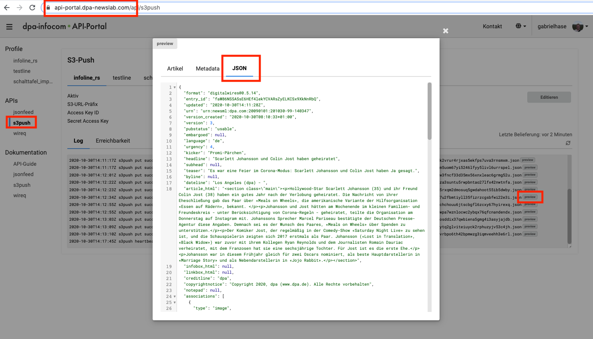

# Livingdocs DPA Import Example

The following example is a boilerplate for an integration of the DPA s3 push feed into Livingdocs using serverless technologies.
As a customer you will want to make a fork of this repository and adapt it to fit your specific Livingdocs setup (metadata and design).

The boilerplate is a local serverless application that runs against the Livingdocs service or any other Livingdocs instance.


## Running (local)

1. Create an account on Livingdocs (https://edit.livingdocs.io) and create an API Access token with write rights.

2. Install dependencies
```
npm ci
```

3. Configure s3local profile
```
aws configure --profile s3local
```

Set both the Access Key Id and the Secret Access Key to "S3RVER".

4. Set Livingdocs ENV variables
```
export LI_TOKEN='<your-project-token-with-import-rights>'
export LI_HOST='https://server.livingdocs.io'
```

Note: make sure to configure an API token that has write rights.

5. Start serverless with your profile
```
AWS_PROFILE=s3local sls offline start
```

6. Get a test file

You need to get a test file with your own DPA Infocom Login.
a. Login at https://api-portal.dpa-newslab.com/
b. Select S3 Push
c. Click "Preview" on any of the articles in the Feed
d. Go to the "JSON" tab
e. Copy and paste the complete JSON into the `test.json` file in this repository



7. Test the import (in a new cl window)
```
aws --endpoint http://localhost:4569 s3 cp ./test.json s3://local-bucket/test-transfered-foo.json --profile s3local
```

After a successful import the DPA article will be visible in your Livingdocs sandbox account under "Articles".

Note: the image urls of DPA feeds expire after a while. If the image upload fails you probably need to update the example with a recent one. DPA s3 push examples can be found directly from their website: https://api-portal.dpa-newslab.com/api/s3push

Note: If you don't use the Livingdocs service sandbox or magazine project, you need to adapt the boilerplate to your specific design.

## Customizing

This section assumes that you have your own design and want to adapt the DPA importer to this design and your custom metadata.

### Images

Navigate to `mappers/image_mapper` and adapt the mapping of image metadata to your specific setup of the media library (https://developers.livingdocs.io/reference-docs/project-config/media_types).
For the available metadata on the DPA source images, see their documentation: https://api-portal.dpa-newslab.com/doc/s3push-deep-dive

### Metadata

Navigate to `mappers/document_mapper` and adapt the `mapMetadata` method to match the metadata you configured in your Livingdocs project (https://developers.livingdocs.io/reference-docs/project-config/content_types#metadata).
For the available metadata on the DPA source documents, see their documentation: https://api-portal.dpa-newslab.com/doc/s3push-deep-dive

### Content Type

Navigate to `mappers/document_mapper` and adapt the `mapContentType` method to return the handle for the target content-type in Livingdocs.

### Design

Navigate to `mappers/document_mapper` and adapt the `mapDocument` method. Use the `transmogrifier` plugin to transform the generic DPA Livingdocs design to your custom design. For documentation about the transmogrifier, navigate to the codefile `lib/transmogrifier/index.js`.

The generic Livingdocs DPA Design will always have the following structure:
- header
- paragraph (optional, if lead is present)
- images
- any number (and order) of:
  - paragraph
  - subtitle
  - free-html (table)
  - iframe
  - tweet

See `dpa-design/components` for a reference of the generic Livingdocs design.
To learn about the Livingdocs design config in your Livingdocs project, see the documentation here: https://developers.livingdocs.io/reference-docs/project-config/design

## Contributing

Please do not make PRs or request changes regarding metadata or design changes that are specific to your use case. This is a  boilerplate project and meant to be generic.

We are very happy though if you find bugs or contribute to general functionality such as an AWS deployment script or mapping of more DPA content to the generic Livingdocs design. For a PR, please use the following guidelines:
- for bugs, always provide a unit test with the error in question
- provide a description with the motivation for the PR
- provide a changelog section with detailed points about all technical changes you made


### Flow

The flow of the application can be seen in `handler.js`.
An s3 push events listens for incoming DPA articles over the s3 push API. The command in "Running" simulates an incoming DPA article for test reasons.

The general flow is:
- import images to Livingdocs, providing a webhook as a callback
- in the webhook take the processed images and put them into a Livingdocs article using a transformation of the DPA source article
- send the Livingdocs article (with images) to Livingdocs for import

In more detail:

The `s3hook` method is called when a new DPA article arrives. The article is parsed for images and then:
1. the images are sent to Livingdocs as a batch for import, returning a batchId from Livingdocs
2. the complete dpa article is stored together with the batchId in a dynamoDB

The call in (1) is provided a webhook to be called when the image import is finished. This webhook is the apiGateway method `imagesImported`.

The `imagesImported` method gets:
1. the stored DPA record from the dynamoDB
2. the imported images in Livingdocs format from the Livingdocs API

If any of the images failed to import, we will fail the complete DPA article import. You can adapt that behavior if you like.

Then both the DPA article and the images are passed to a transformation method that produces a valid Livingdocs document JSON in the target format and sends it to Livingdocs for import. We again provide a webhook `documentsImported` that is called once the document import has finished.

The `documentsImported` method then only checks for potential issues and sets the dynamoDB entry for this dpa article to failed or success respectively.

### Transformation

The transformation process is described above in "Customizing".

The transformation happens in 2 steps:
- transform a DPA source article into a generic Livingdocs design (`dpa-design/components`)
- transform the generic Livingdocs design into your specific project design

The central part is the `transmogrifier` plugin that stores a Livingdocs document as a linked list for fast processsing of operations such as renames or transforms. Those operations can be used to transform the generic Livingdocs design for DPA articles into the specific design that you have in your project.

The `transmogrifier` is experimental at this point. Once it matures, we will add this to the Livingdocs SDK.

### Traceability

All imports are stored in dynamoDB for traceability.
Imports that arrive in Livingdocs are also stored and can be monitored thorugh the "Import Jobs" Dashboard in the "Project Setup" section.

